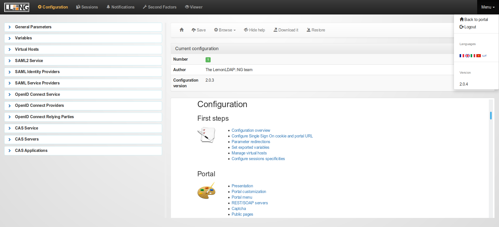

# LemonLDAP::NG Workshop

Workshop on [LemonLDAP::NG](https://lemonldap-ng.org/) for [Pass the SALT 2019](https://2019.pass-the-salt.org/).


Goals:
* Install LemonLDAP::NG
* Configure authentication to OpenLDAP
* Protect sample applications with Handler
* Enable 2FA

Prerequisites:
* Virtualization system (like VirtualBox)
* Possibility to edit hosts file or a local DNS system
* Internet access

## Virtual image and first checks

Download the virtual image [from this repository](pts2019.ova) and import it.

After starting the image, you should be able to log in on console with : root / password

To log with SSH, use : worteks / password and then:
```
su -
```

Check which IP address was associated to your virtual machine. We will use the variable `VM_IP` in this documentation, you need to replace it by the IP of your own virtual machine.

### LDAP server

[OpenLDAP LTB](https://ltb-project.org/documentation/openldap-deb) server is already installed, you can check the service status:
```
systemctl status slapd
```

Access to configuration:
```
ldapvi -Y EXTERNAL -h ldapi:/// -b cn=config
```

Access to data:
```
ldapvi -Y EXTERNAL -h ldapi:/// -b dc=worteks,dc=com
```

### LDAP browser

[Fusion Directory](https://www.fusiondirectory.org/) is already installed, you can access it on http://`VM_IP`/fusiondirectory/.

You should see the following screen:


Log in with: fd-admin / password

You should see the following screen:


:exclamation: Now you are on your own. Follow the following steps and try to achieve all points!

## LemonLDAP::NG installation

:information_source: See also [official documentation](https://lemonldap-ng.org/documentation/latest/installdeb).

Use official repository:
```
vi /etc/apt/sources.list.d/lemonldap-ng.list
```
```
# LemonLDAP::NG repository
deb     https://lemonldap-ng.org/deb 2.0 main
deb-src https://lemonldap-ng.org/deb 2.0 main
```

Get GPG key:
```
wget -O - https://lemonldap-ng.org/_media/rpm-gpg-key-ow2 | apt-key add -
```

Update:
```
apt update
```

Install main package with Apache mod_perl:
```
apt install libapache2-mod-perl2 lemonldap-ng
```

:information_source: LemonLDAP::NG is of course also compatible with Nginx, but this workshop is designed to run with Apache.

Install Apache FCGID module:
```
apt install libapache2-mod-fcgid
```

Enable modules and configurations:
```
a2ensite manager-apache2.conf
a2ensite portal-apache2.conf
a2ensite handler-apache2.conf
a2enmod fcgid perl alias rewrite headers
```

Test configuration:
```
apachectl configtest
```

Restart Apache:
```
systemctl restart apache2
```

:information_source: We use the default domain `example.com`. It can be changed with the next command:
```
sed -i 's/example\.com/worteks.com/g' /etc/lemonldap-ng/* /var/lib/lemonldap-ng/conf/lmConf-1.json
```

:exclamation: If you do it, adapt the following steps to use your specific domain instead of `example.com`.

## First access

Configure your local DNS or edit your local `/etc/hosts` (on your host, not on the virtual machine) with:
```
VM_IP	auth.example.com manager.example.com test1.example.com test2.example.com
```

Then open your web browser and go to http://auth.example.com

You should see the following screen:


Log in with: dwho / dwho

You should see the following screen:


Click on WebSSO Manager to access the administration interface, or use http://manager.example.com

You should see the following screen:



:information_source: Further configuration steps could be done with this graphical interface, but in this workshop we will use the [Command Line Interface](https://lemonldap-ng.org/documentation/latest/configlocation#command_line_interface_cli):
```
/usr/share/lemonldap-ng/bin/lemonldap-ng-cli help
```

## Access to sample application

LemonLDAP::NG provides a sample application that reads HTTP headers. To enable it:
```
a2ensite test-apache2.conf
systemctl reload apache2
```

You can see that this is a standard Apache virtual host, the only added line it the call the LL::NG Handler:
```
vi /etc/apache2/sites-enabled/test-apache2.conf
```
```apache
    # SSO protection
    PerlHeaderParserHandler Lemonldap::NG::Handler::ApacheMP2
```

Access to the sample application: http://test1.example.com

You should see the following element in the screen:


You are authenticated! If you logout from the WebSSO (http://auth.example.com/logout), and try to access to the sample application, you will be forced to log in.

## LDAP configuration

The WebSSO is currently in [demo mode](https://lemonldap-ng.org/documentation/latest/authdemo), with built-in accounts (do you like [Doctor Who](https://en.wikipedia.org/wiki/Doctor_Who)?). Now we will configure LemonLDAP::NG to use the local LDAP directory.

Use the command line to set LDAP parameters:
```
/usr/share/lemonldap-ng/bin/lemonldap-ng-cli -yes 1 \
    set \
        authentication LDAP \
        userDB LDAP \
        passwordDB LDAP \
        registerDB LDAP \
        ldapServer 'ldap://localhost' \
        managerDn 'cn=websso,ou=dsa,dc=worteks,dc=com' \
        managerPassword 'WebSSOPassword' \
        ldapBase 'ou=users,dc=worteks,dc=com' \
        ldapPpolicyControl 1
```
```
/usr/share/lemonldap-ng/bin/lemonldap-ng-cli -force 1 -yes 1 \
    addKey \
        ldapExportedVars uid uid \
        ldapExportedVars cn cn \
        ldapExportedVars sn sn \
        ldapExportedVars mail mail \
        ldapExportedVars givenName givenName
```

To clear configuration cache, restart Apache:
```
systemctl restart apache2
```

Now you can connect to SSO portal with the LDAP user : fd-admin / password
